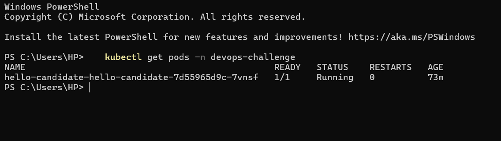
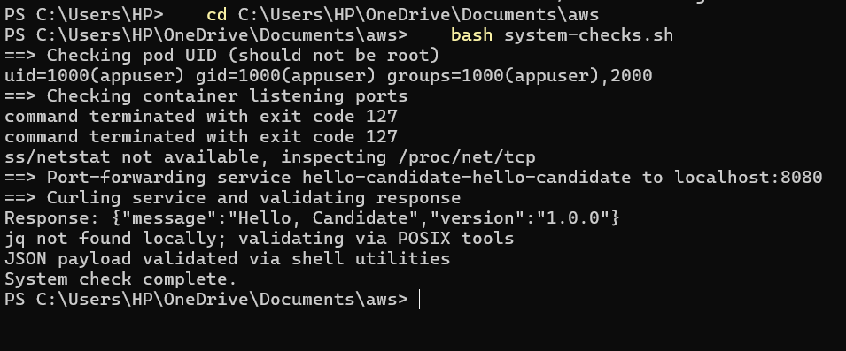

# AWS DevOps Challenge

End-to-end solution composed of a FastAPI application, Terraform-managed Kubernetes namespace/quota, Helm deployment, CI automation, and validation scripts.

## Repository Layout

```
.
├── app/                  # FastAPI service returning the required JSON payload
├── helm/hello-candidate/ # Helm chart (Deployment + Service + securityContext)
├── terraform/            # Namespace + ResourceQuota using the Kubernetes provider
├── .github/workflows/    # GitHub Actions pipeline (lint + validate + docker build)
├── Dockerfile            # Non-root Python image exposing port 80
├── setup.sh              # Local automation (build + terraform + helm)
└── system-checks.sh      # Validation script proving runtime requirements
```

## Prerequisites

Install the following tools locally:

- Docker Desktop (with Kubernetes enabled) or access to a Kubernetes cluster.
- kubectl (configured to point at the cluster where you want to deploy).
- Helm 3.x.
- Terraform ≥ 1.4 (matching the provider block in `terraform/main.tf`).
- Bash (for running `setup.sh` and `system-checks.sh`). On Windows, Git Bash or WSL works well.
- Optional: `jq` for richer output in `system-checks.sh` (the script falls back to POSIX tools otherwise).

## Local Automation (`setup.sh`)

1. Ensure Docker Desktop/Kubernetes is running and `kubectl config current-context` points to the desired cluster.
2. Execute:

   ```bash
   ./setup.sh
   ```

   The script performs:

   - `docker build -t hello-candidate .`
   - `terraform -chdir=terraform init && terraform apply -auto-approve` to provision the `devops-challenge` namespace and 512 Mi ResourceQuota.
   - `helm upgrade --install hello-candidate helm/hello-candidate -n devops-challenge` to deploy the chart.

3. Validate the deployment with:

   ```bash
   bash system-checks.sh
   ```

## Port 80 vs Non-Root Strategy

The container image runs entirely as the unprivileged user `appuser` (UID 1000). Instead of granting Linux capabilities inside the image, the Helm chart adds the minimal capability required (`NET_BIND_SERVICE`) directly in the pod `securityContext` while keeping `allowPrivilegeEscalation: false`, `readOnlyRootFilesystem: true`, and dropping all other capabilities. This lets the process bind to port 80 without running as root and keeps the file system immutable except for an `emptyDir` mounted at `/tmp`.

## Continuous Integration

`.github/workflows/ci.yml` runs on every push and:

1. Installs dependencies and lints Python with `flake8`.
2. Lints the Helm chart via `helm lint helm/hello-candidate`.
3. Runs `terraform init -backend=false` and `terraform validate` inside `terraform/`.
4. Builds the Docker image (`docker build -t hello-candidate-ci .`) to ensure Dockerfile health.

## Validation Script (`system-checks.sh`)

This script:

1. Shows the UID inside the pod (`kubectl exec ... -- id`) to prove it is non-root.
2. Confirms the process is bound to port 80 (preferring `ss`/`netstat`, falling back to parsing `/proc/net/tcp`).
3. Port-forwards the service to `localhost:8080`, curls `/`, and verifies the JSON payload.

Run it any time with:

```bash
bash system-checks.sh
```

## Screenshots

| Description | Image |
|-------------|-------|
| Pods in `devops-challenge` namespace |  |
| `system-checks.sh` validation |  |

These were generated directly from the command outputs in this repository (`screenshots/` directory).

## Cleanup

When finished, remove the resources with:

```bash
terraform -chdir=terraform destroy -auto-approve
helm uninstall hello-candidate -n devops-challenge
```

Optionally delete the Docker image (`docker rmi hello-candidate`) and Kubernetes namespace if Terraform is not used for cleanup.

